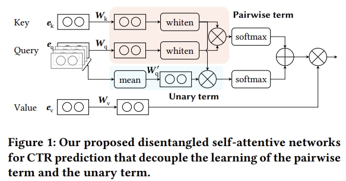

# DESTINE



This is the code for the CIKM 2021 Paper: [Disentangled Self-Attentive Neural Networks for Click-Through Rate Prediction](https://dl.acm.org/doi/abs/10.1145/3459637.3482088).

## Usage

Data for Avazu and Criteo should be downloaded and be put at `$ROOT_DIR/data/avazu` and `$ROOT_DIR/data/criteo`,
where `$ROOT_DIR` is the directory of this Git project on your machine.

The experiments on Criteo and Avazu can be run via executing `bash run_criteo.sh` and `bash run_avazu.sh`.

## Requirements

- pretty_errors
- torch
- sklearn
- torchfm
- PyYAML
- nni

## Citation

Please cite our paper if you use the code:

```
@inproceedings{xu2021disentangled,
  title={Disentangled self-attentive neural networks for click-through rate prediction},
  author={Xu, Yichen and Zhu, Yanqiao and Yu, Feng and Liu, Qiang and Wu, Shu},
  booktitle={Proceedings of the 30th ACM international conference on information \& knowledge management},
  pages={3553--3557},
  year={2021}
}
```

```bibtex
@inproceedings{Xu:2021uz,
author = {Xu, Yichen and Zhu, Yanqiao and Yu, Feng and Liu, Qiang and Wu, Shu},
title = {{Disentangled Self-Attentive Neural Networks for Click-Through Rate Prediction}},
year = {2021},
isbn = {9781450384469},
publisher = {Association for Computing Machinery},
address = {New York, NY, USA},
url = {https://doi.org/10.1145/3459637.3482088},
doi = {10.1145/3459637.3482088},
abstract = {Click-Through Rate (CTR) prediction, whose aim is to predict the probability of whether a user will click on an item, is an essential task for many online applications. Due to the nature of data sparsity and high dimensionality of CTR prediction, a key to making effective prediction is to model high-order feature interaction. An efficient way to do this is to perform inner product of feature embeddings with self-attentive neural networks. To better model complex feature interaction, in this paper we propose a novel DisentanglEd Self-atTentIve NEtwork (DESTINE) framework for CTR prediction that explicitly decouples the computation of unary feature importance from pairwise interaction. Specifically, the unary term models the general importance of one feature on all other features, whereas the pairwise interaction term contributes to learning the pure impact for each feature pair. We conduct extensive experiments using two real-world benchmark datasets. The results show that DESTINE not only maintains computational efficiency but achieves consistent improvements over state-of-the-art baselines.},
booktitle = {Proceedings of the 30th ACM International Conference on Information and Knowledge Management},
pages = {3553–3557},
numpages = {5},
keywords = {high-order feature interaction, disentangled self-attention, click-through rate prediction},
location = {Virtual Event, Queensland, Australia},
series = {CIKM '21}
}
```
